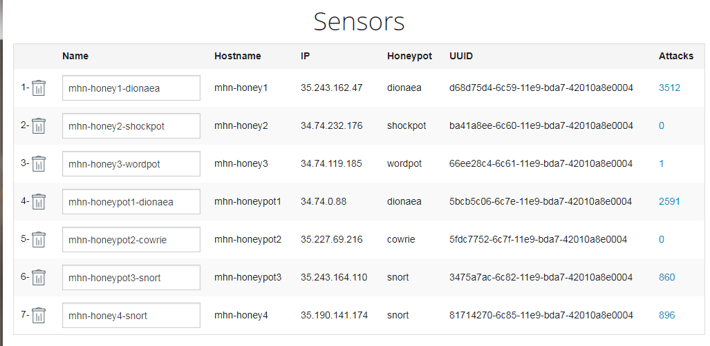

# Cybersecurity-WEEK-10-11-Honeypot

## Setup:
  Milestone 0: To the Cloud!

  Milestone 1: Create MHN Admin VM

  Milestone 2: Install the MHN Admin Application

  Milestone 3: Create a MHN Honeypot VM
  
  Milestone 4: Install the Honeypot Application

  Milestone 5: Attack!

  # GIF for MHN Admin Application
  

## Any Issue Encoutered
Configuration of mhn and vm instances actually took a lot of time but overall all the issues had been resolved.
ERROR 1: Killed python initdatabase.py. Once run $ sudo supervisorctl status, only geoloc, honeymap, hpfeeds-broker                and mnemosyne are running. (solution: increase VM RAM to at least 1GB)
ERROR 2: mhn-celery-worker do not running (solution: undate python version to 3.2.1 or higher in mhn-admin VM)
ERROR 3: When connect honeypots to mhn-admin always return a failure message: connection time out. 
         (solution: check/rebuild mhn-admin and mhn-honeypot firewall. Also try to run [$ sudo apt-get update] and 
         [$ sudo apt-get install software-properties-common -y] in mhn-honeypot ssh)

## Summary of data collected
(Collection time: 5:42 PM 5/2/20190
  ### TOP 5 Attacker IPs:
  1.  103.213.208.26 (366 attacks)
  2.  46.101.105.47 (196 attacks)
  3.  111.230.113.70 (182 attacks)
  4.  185.176.27.186 (130 attacks)
  5.  51.38.221.54 (126 attacks)

  ### TOP 5 Attacked ports:
  1.  23 (802 times)
  2.  5060 (748 times)
  3.  445 (635 times)
  4.  8088 (488 times)
  5.  1433 (264 times)

## Deployed Honeypots.

### session.json contains all attack reports.

## Time Spent
12 hours approx. Most time is to fix error
